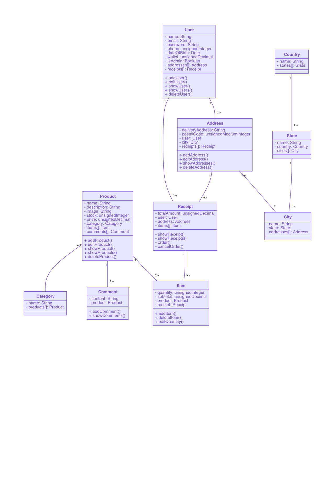

# Entregable 1 - Arquitectura MVC

## 1. Equipo de Trabajo

- Santiago Arredondo Quintero
- Kevyn Santiago Gómez Patiño
- Santiago Castrillón Galvis
- Camilo Gaviria Castrillón

## 2. Modelo Verbal Definitivo

El proyecto Droppy consiste en una tienda virtual donde se venderán productos bajo el modelo de negocio de Dropshipping (en este modelo no es necesario comprar los productos y tener un stock, permite que seamos intermediarios entre el comprador final y el productor).

Droppy al tiempo que nos representa un beneficio económico ya que cobramos una  comisión por la compra de cada producto, los usuarios también se benefician con precios muy bajos al comprar indirectamente al productor. Tendremos proveedores de productos, administradores de la página y usuarios.  Esperamos que Droppy sea una tienda interactiva y rápida, donde sea fácil buscar, visualizar y comprar productos.

## 3. Diagrama de Clases

## 4. Diagrama de Arquitectura

